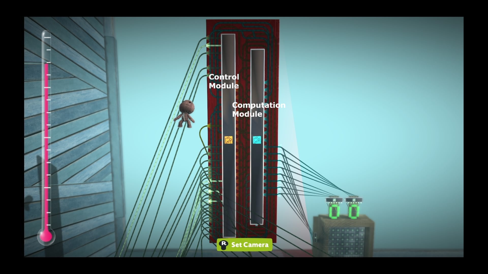
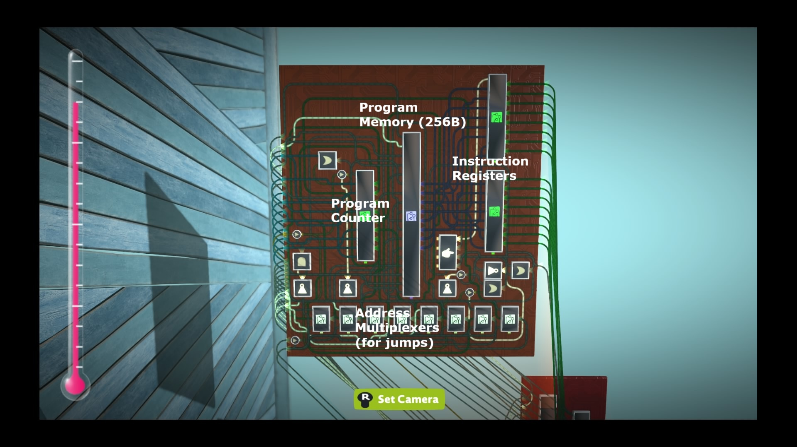
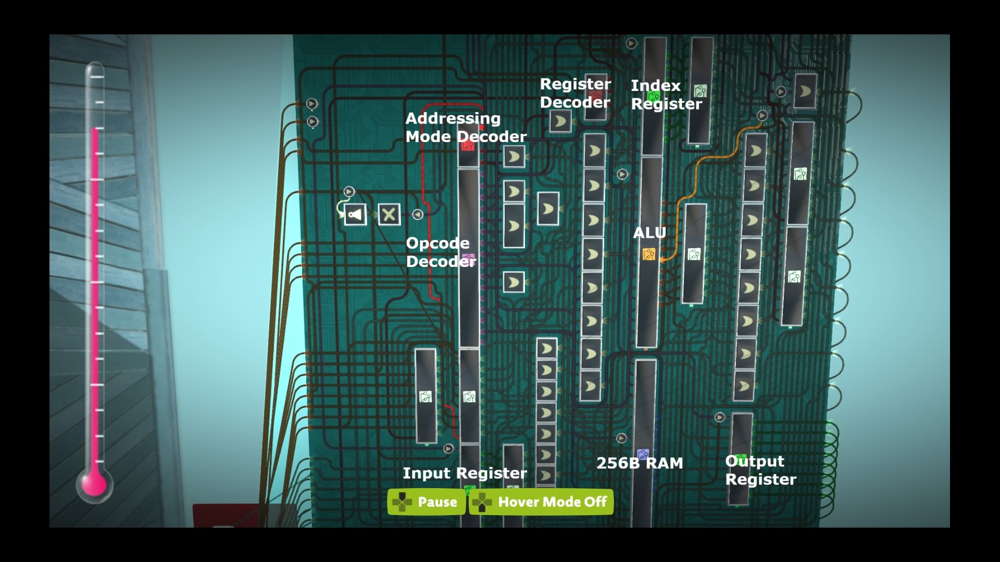
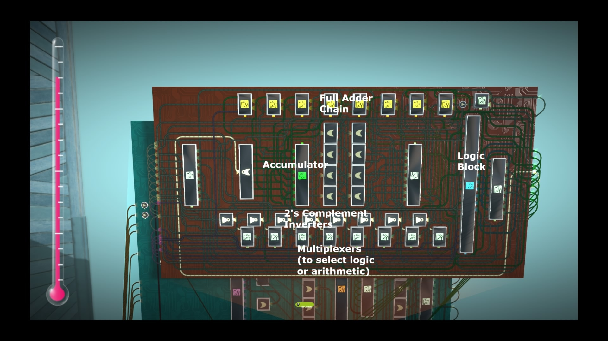
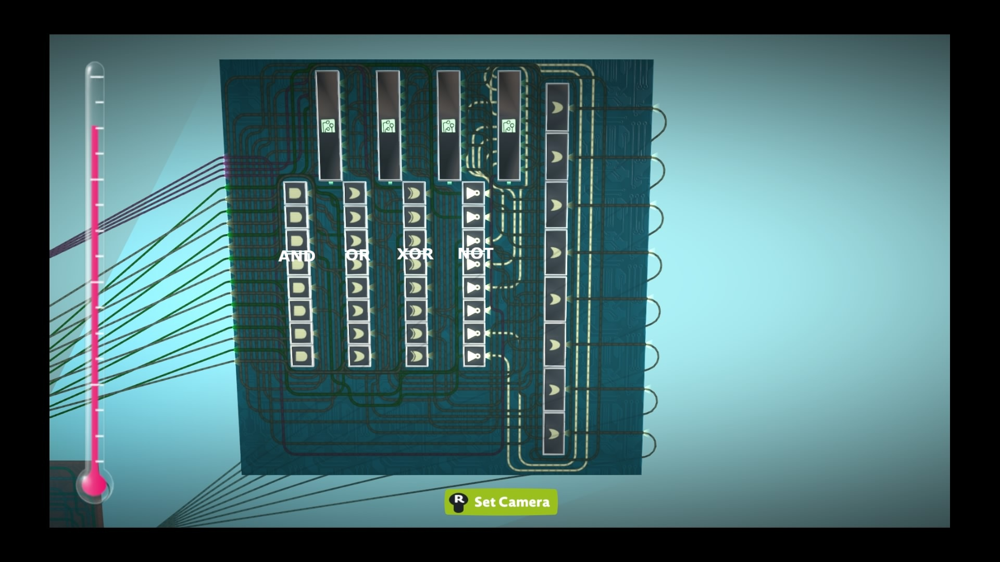
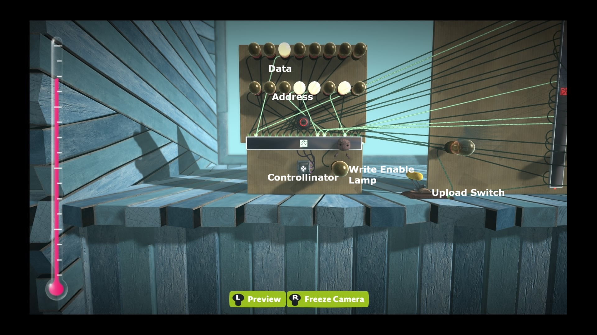
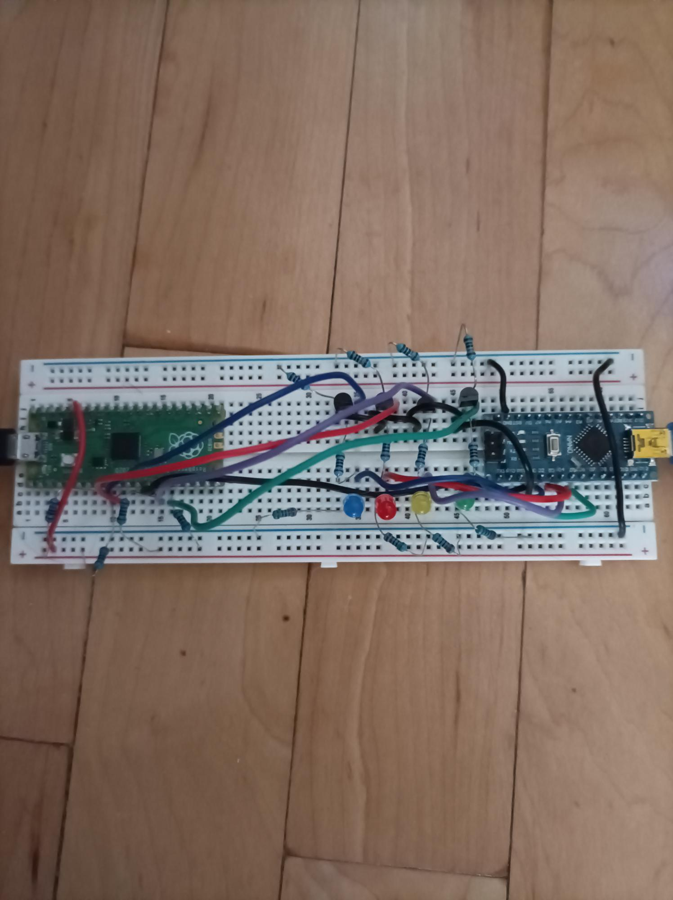

# LBP-8 CPU

## Introduction

The LBP-8 is an 8-bit CPU built in LittleBigPlanet 3. It has a simple
ALU, 256B RAM, and supports 4 addressing modes.

## Components



<em>Main microchip.</em>


<em>Inside the control module microchip. This fetches binary instructions from memory, and sends them to the computation module.</em>


<em>Inside the computation module microchip. This is the "brain" of the CPU, and is responsible for actually executing the instructions provided to it by the control module.</em>


<em>Inside the ALU microchip. This performs arithmetic and logical operations.</em>


<em>Inside the logic block microchip. This is part of the ALU, and performs logical operations like AND and OR.</em>


<em>The display consists of two 7-segment displays and an 8x8 dot matrix. The 7-segment displays show the byte in the output register in hexadecimal format. The dot matrix allows for simple, monochrome (red on black) pixel art.</em>


<em>This is designed to work with the programmer device. Before running the assembler, use the Controllinator. This allows the uploader tool to interface with the game via PS Remote Play, and type in a program.</em>

## Registers

| Register | Description                                           |
|----------|-------------------------------------------------------|
| A        | Accumulator. Stores results of arithmetic and logic operations. Implicit operand for most instructions. |
| X        | Index register. Supports load and increment operations only. |
| I        | Input register. Stores data from the input bus.      |
| O        | Output register. Sends data to an external system.  |

## Flags

| Flag | Description                                                   |
|------|---------------------------------------------------------------|
| Z    | Set if the accumulator is zero.                               |
| C    | Set if the last arithmetic operation resulted in a value too large to be represented; cleared otherwise. |

## Addressing Modes

| Mode              | Syntax       | Description                                           |
|------------------ |------------- |------------------------------------------------------|
| Immediate         | #value       | Operand is literal (e.g. LDA #5)                    |
| Register          | %register    | Operand is a register's value (e.g. LDA %X)         |
| Direct            | $address     | Operand is value in memory (e.g. LDA $20)           |
| Register pointer  | $register    | Operand is at the address stored in the specified register (e.g. LDA $I) |


> **Note:** STA is only valid in direct or register pointer mode.

## Instruction Set

| Mnemonic | Description                       | Valid Modes                     | Flags Affected |
|----------|-----------------------------------|---------------------------------|----------------|
| IN       | Loads the I register with the current input value | N/A                             | N/A            |
| ADD      | Add to accumulator                | Immediate, register, direct, register pointer | Z, C           |
| SUB      | Subtract from accumulator         | Immediate, register, direct, register pointer | Z, C           |
| AND      | Performs a bitwise AND on the accumulator | Immediate, register, direct, register pointer | Z              |
| XOR      | Performs a bitwise XOR on the accumulator | Immediate, register, direct, register pointer | Z              |
| OR       | Performs a bitwise OR on the accumulator | Immediate, register, direct, register pointer | Z              |
| NOT      | Performs a bitwise NOT on the accumulator | N/A                             | Z              |
| LDA      | Load accumulator                  | Immediate, register, direct, register pointer | Z              |
| STA      | Store accumulator at specified address in memory | Direct, register pointer        | N/A            |
| LDX      | Load index register                | Immediate, register, direct, register pointer | N/A            |
| INCX     | Increment index register           | N/A                             | N/A            |
| JMP      | Unconditional jump                 | Immediate, register, direct, register pointer | N/A            |
| JC       | Jump if carry flag is set          | Immediate, register, direct, register pointer | N/A            |
| JZ       | Jump if zero flag is set           | Immediate, register, direct, register pointer | N/A            |
| OUT      | Load the output register           | Immediate, register, direct, register pointer | N/A            |
| HLT      | Stop execution                     | N/A                             | N/A            |


> **Note:** The subsequent instruction after a jump is not loaded reliably. The assembler automatically inserts an IN instruction before the main block to be
executed after a jump to work around this issue.

## Using the Assembler

This tool allows you to compile and assemble programs for the LBP-8 CPU and upload them via a connected programmer. The assembler supports both direct assembly files and higher-level programs that require compilation first. The compiler is very rough, and at this time I do not recommend using it.

> **Note:** When uploading a program, ensure you are using the Controllinator on the in-game programmer terminal. You will also need an active PS Remote Play connection.

### Prerequisites

- Python 3.8+
- pyserial library (pip install pyserial)
- tqdm library for progress bars (pip install tqdm)
- colorama for colored terminal output (pip install colorama)
- A connected LBP-8 programmer
- PS Remote Play


<em>LBP-8 Programmer. The Raspberry Pi Pico emulates a DualShock 4 for PS Remote Play, and the Arduino Nano receives the button sequence from the assembler.</em>

### Command-Line Usage

```bash
python lbp8.py [options] target_file
```

### Arguments

- `target_file` - Path to the program file you want to assemble or compile.
   
### Options

| Option           | Description                                                                                                                     |
| ---------------- | ------------------------------------------------------------------------------------------------------------------------------- |
| `-a, --assembly` | Skip compilation and directly assemble the file contents. Use this if the target file is already in assembly.                   |
| `-c, --compile`  | Compile the target file first before assembling. Use this if the file contains higher-level instructions (LET, DIM, PRINT, etc.). VERY ROUGH! |
| `-v, --verbose`  | Enable verbose output. Prints the generated assembly, binary, and programmer button sequence for debugging or inspection.                     |

### Troubleshooting

- **Programmer not detected:** Ensure the device is connected and recognized by your system. The tool will scan available serial ports automatically.
- **File not found:** Check the `target_file` path.
- **Invalid instruction or operand:** Ensure your program uses valid LBP-8 mnemonics and addressing modes.
- **Program too long:** Maximum program size is 256 bytes.

## Example Program

This program detects a change in the input value, then outputs the new value multiplied by 2.

```asm
lda #0 ; Reset the accumulator

loop:
in ; Read the input
sub %i ; Subtract input from the accumulator
jz same ; Check if it is different

lda %i ; Update the accumulator
add %i ; Add the value to itself, to multiply it by 2
out %a ; Display the value
lda %i ; Restore the original value
jmp loop

same:
lda %i ; Restore the original value
jmp loop
```
  
